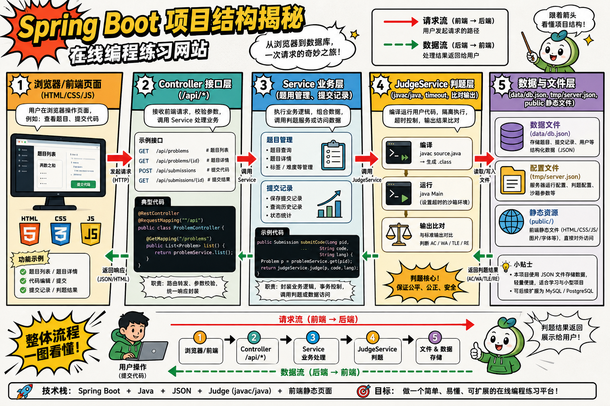

# CodingWeb Spring Boot 版

这是一个本地刷题网站项目，已经从原来的 Node 单文件后端迁移为 Spring Boot 后端。

现在的目标不是做成一个完整线上判题平台，而是先保留你熟悉的本地开发体验，同时把项目结构整理成更适合后续扩展的标准 Java 工程。

## 项目目标

- 保留现有前端页面和交互方式
- 用 Spring Boot 组织后端代码
- 继续使用本地 JSON 文件保存题目和提交记录
- 保留 Java 判题流程，方便后续再升级成 Docker 隔离判题

## 整体框架

项目现在大致分成 5 层：

1. 前端静态资源层
   - `public/index.html`
   - `public/app.js`
   - `public/styles.css`
   - 这一层负责页面展示、表单交互和结果渲染。

2. Web 接口层
   - `src/main/java/com/codingweb/controller/CodingWebController.java`
   - 负责对外提供 `/api/*` 接口。

3. 业务服务层
   - `src/main/java/com/codingweb/service/CodingWebService.java`
   - 负责题目 CRUD、提交记录、样例恢复、本地数据读写。

4. 判题服务层
   - `src/main/java/com/codingweb/service/JudgeService.java`
   - 负责编译、运行、比对输出、超时控制、输出大小控制。

5. 配置与启动层
   - `src/main/java/com/codingweb/CodingWebApplication.java`
   - `src/main/java/com/codingweb/config/StaticResourceConfig.java`
   - `src/main/java/com/codingweb/config/StartupInfoWriter.java`
   - 负责 Spring Boot 启动、静态资源映射、启动信息写入。

下面这张图可以先帮你把项目整体结构串起来：



## 目录结构

```text
CodingWeb/
├── data/
│   └── db.json                # 本地题库和提交记录
├── public/                    # 前端页面
├── src/
│   └── main/
│       ├── java/
│       │   └── com/codingweb/ # Spring Boot 后端代码
│       └── resources/
│           └── application.properties
├── tmp/                       # 运行时临时文件和启动信息
├── pom.xml                    # Maven 构建文件
└── README.md
```

## 主要依赖

### 运行环境

- Java 22
- Maven 3.9+

### Spring Boot 依赖

- `spring-boot-starter-web`
  - 提供 Web MVC、内嵌 Tomcat、JSON 接口支持
- `spring-boot-starter-validation`
  - 提供 `@NotBlank` 等参数校验
- `spring-boot-starter-test`
  - 提供测试基础能力，后续可直接补单元测试

### 传递依赖

Spring Boot Web 会自动带上常用基础库，例如：

- Jackson
  - 用于 JSON 序列化和反序列化
- Tomcat
  - 作为内嵌 Web 容器
- Spring Web / Spring MVC
  - 作为控制器和静态资源映射基础

## 启动方式

### 方式一：命令行

```powershell
Set-Location -LiteralPath "F:\\项目\\CodingWeb"
mvn spring-boot:run
```

### 方式二：IDE

如果你本机没有 Maven 命令，也可以直接用 IntelliJ IDEA、Eclipse 或 VS Code 导入 `pom.xml`，然后运行：

- `com.codingweb.CodingWebApplication`

## 启动行为

- 默认监听 `127.0.0.1`
- 默认优先使用 `3000` 端口
- 如果 `3000` 到 `3010` 被占用，会自动尝试下一个端口
- 启动成功后会写入 `tmp/server.json`

`tmp/server.json` 的作用是方便你快速查看当前实际访问地址，例如：

```json
{
  "url": "http://127.0.0.1:3000",
  "port": 3000,
  "pid": 12345
}
```

## 数据存储

当前项目没有接数据库，先用本地 JSON 文件模拟持久化：

- `data/db.json`

保存内容包括：

- 题目列表
- 测试用例
- 提交记录

这样做的好处是简单、直观、方便你一边开发一边观察数据变化。后续如果要升级成 MySQL / PostgreSQL，可以把这一层替换成 Repository / DAO。

## API 概览

### 题目相关

- `GET /api/problems`
  - 获取题目列表
- `GET /api/problems/{id}`
  - 获取做题页题目详情
- `GET /api/problems/{id}/edit`
  - 获取编辑页完整题目数据
- `POST /api/problems`
  - 新建题目
- `PUT /api/problems/{id}`
  - 更新题目
- `DELETE /api/problems/{id}`
  - 删除题目
- `POST /api/problems/seed`
  - 恢复示例题

### 判题相关

- `POST /api/submissions/run`
  - 运行样例，不落库
- `POST /api/submissions/submit`
  - 正式提交，会写入历史记录
- `GET /api/submissions`
  - 获取提交列表
- `GET /api/submissions/{id}`
  - 获取提交详情

## 判题说明

当前仍然是“本机 Java 判题”，流程是：

1. 做基础代码安全检查
2. 把用户代码写入临时目录
3. 使用 `javac` 编译 `Main.java`
4. 使用 `java Main` 逐个运行测试用例
5. 对比标准输出和期望输出
6. 清理临时目录

这套实现适合本地开发和学习，但还不是正式线上判题方案。后续如果要上线，建议把判题迁移到 Docker 容器中。

## 当前约定

- 提交代码必须包含 `public class Main`
- 不要写 `package xxx;`
- 不要读写本机文件
- 不要创建系统进程
- 不要访问网络

## 旧文件说明

旧的 Node 入口文件已经清理掉了。当前仓库以 Spring Boot 为准，后续学习和开发都以 `pom.xml` 和 `src/main/java/` 下的代码为主。

## 后续推荐

如果你愿意继续往下做，下一步通常有三条路线：

1. 把 `public/` 迁进 `src/main/resources/static/`，让 Spring Boot 工程更标准。
2. 把 `data/db.json` 改成真正的数据库层。
3. 把判题从本机进程升级成 Docker 隔离执行。
